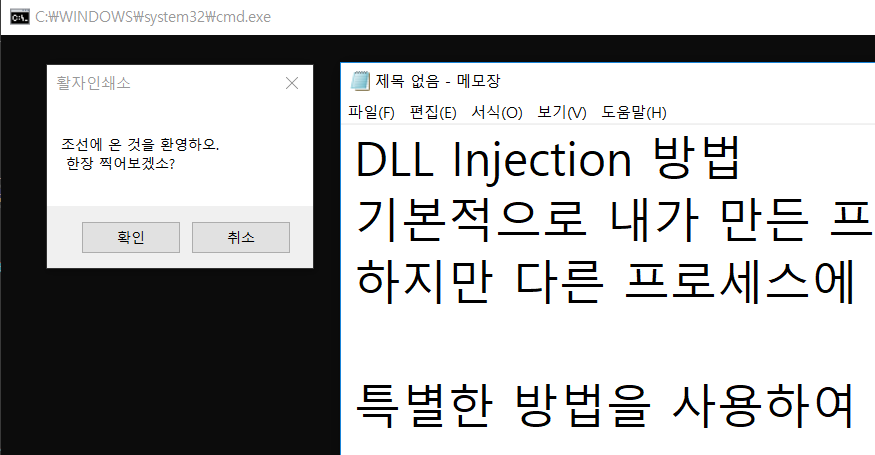

# DLL Injection_Notepad Tutorial(Success)

# DLL Injection Method

Basically, it's easy to load a DLL you created into the process I created.
But the problem is when I want to run the function I want in another process.

I use a special method to load the DLL I created from another process and execute the necessary functions in DllMain.

Now that you have successfully loaded the DLL,
You will have access to memory.
Therefore, various operations are possible.

The core of the code above is the dll_injection () function.

1. Obtain Handle of Injection target process through OpenProcess.
2. Use VirtualAllocEx to allocate memory to the virtual memory space of the process.
The option is to write the memory directly, so you need to Commit instead of making a reservation with Reverse.
 *** The returned remote_buffer is not the memory of my process literally, but the memory address of the target process to be injected.

3. Input the path of the DLL to be loaded as WriteProcessMemory into target process memory.
4. Execute LoadLibrary to create Thread using CreateRemoteThread.
